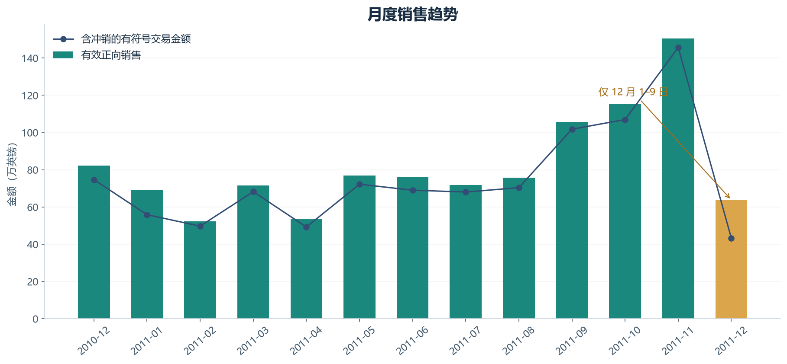
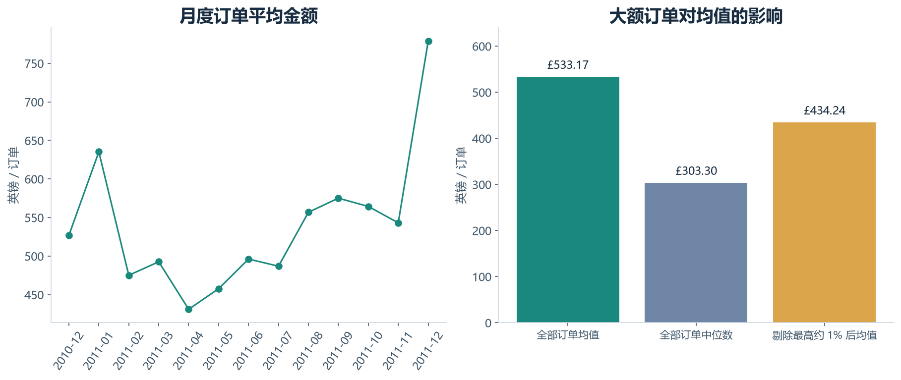
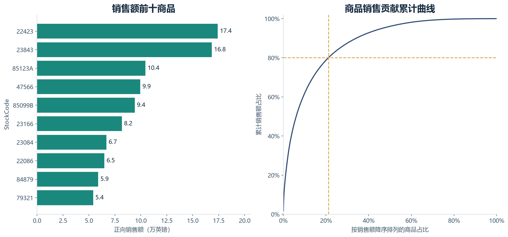
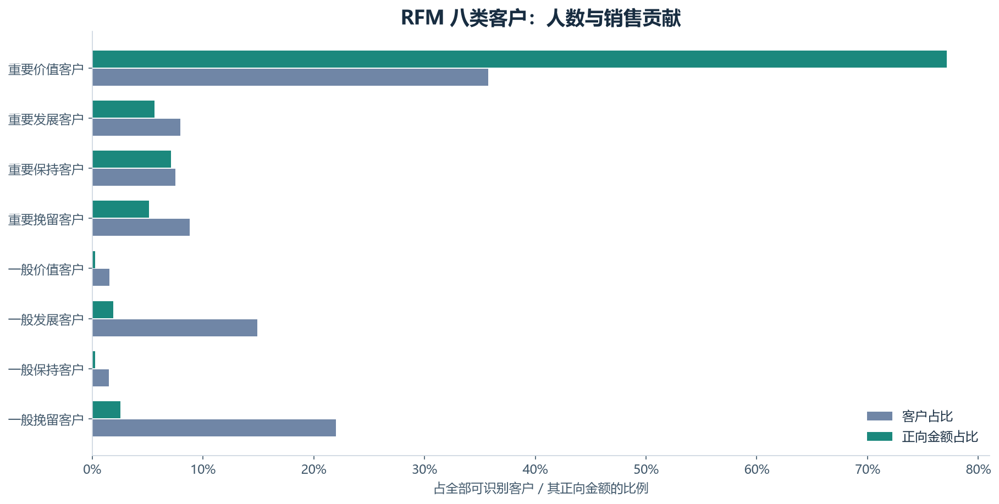
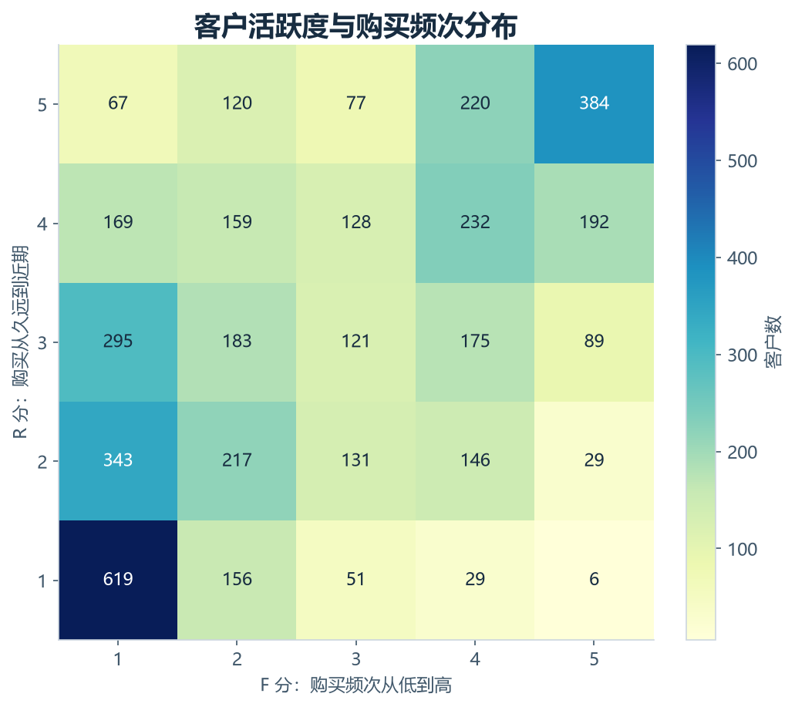

# 电商销售与客户分层分析

校内实训项目 · pandas / MySQL / RFM

## 1. 项目结论

本项目读取 541,909 行原始明细，保留 524,878 行有效正向交易，覆盖 19,960 张订单。有效正向销售额为 £10,642,110.80，订单平均金额为 £533.17，可用于 RFM 的客户有 4,338 人。

完整月份中，2011-11 的正向销售额最高，为 £1,503,866.78。重要价值客户占 35.73%，贡献可识别客户正向金额的 77.14%。这些结果可用于选择优先分析和服务的客群，尚不代表营销措施已经产生效果。

## 2. 数据来源与适用范围

来源：UCI Online Retail，Chen, D. (2015)，DOI 10.24432/C5BW33，CC BY 4.0。数据记录英国一家无实体门店零售商的交易，包含批发客户。来源页：https://archive.ics.uci.edu/dataset/352/online+retail 。

本地文件实际时间范围：2010-12-01 08:26:00 至 2011-12-09 12:50:00。本次 RFM 基准日为 2011-12-10，与当前日期无关。金额单位为英镑，不能当成人民币。UCI 页面缺失值标注与实际文件不完全一致，以下按工作簿实测结果处理。2011 年 12 月仅覆盖 1–9 日，不计算完整月环比。

| 原始字段 | 缺失行数 | 缺失比例 |
| --- | --- | --- |
| InvoiceNo | 0 | 0.00% |
| StockCode | 0 | 0.00% |
| Description | 1454 | 0.27% |
| Quantity | 0 | 0.00% |
| InvoiceDate | 0 | 0.00% |
| UnitPrice | 0 | 0.00% |
| CustomerID | 135080 | 24.93% |
| Country | 0 | 0.00% |

## 3. 清洗规则与审计

一行代表发票中的一条明细，一张订单可有多行。先规范字符串、日期、数量和客户编号，再按原始八字段去重，保留第一次出现的源行。原始完全重复行有 5,268 行，规范化后重复行有 5,268 行。重复行不能仅按订单号去重，否则会丢失同一订单中的其他商品。

剔除原因按顺序互斥归类：重复 → 必要字段无效 → C 开头取消 → 数量≤0 → 单价≤0。表中各类行数相加等于原始总行数。描述或国家缺失不自动删除交易；保留源行号，便于核查。完全相同的行也可能是真实重复购买，本项目按数据清洗假设去重，不宣称已还原订单后台。

缺客户编号的有效交易保留 132,186 行，金额 £1,754,901.91；它们用于整体销售分析，不填补或猜测客户身份，因此不进入 RFM。识别到客户的正向金额覆盖率为 83.51%。

| 处理结果 | 明细行数 | 占原始行数 |
| --- | --- | --- |
| C 开头取消记录 | 9251 | 1.71% |
| 规范化后重复行 | 5268 | 0.97% |
| 此前未剔除且单价≤0 | 1176 | 0.22% |
| 非取消且数量≤0 | 1336 | 0.25% |
| 保留的有效正向明细 | 524878 | 96.86% |

## 4. 金额与订单口径

有效正向销售额 = 非取消、数量>0、单价>0 的去重明细金额之和；明细金额 = Quantity × UnitPrice。主口径包含运费、手续费等正向收费行，因此不能等同于净商品收入。订单数 = 有效明细中 InvoiceNo 去重数；订单平均金额 = 正向销售额 ÷ 订单数，不是每条商品明细的均价。

金额内部使用万分之一英镑的整数，保留原始价格的小数精度；汇总完再显示两位小数。MySQL 也采用相同整数单位，因此金额核对要求完全相等。

辅助口径“含冲销的有符号交易金额”为 £9,748,131.07：保留去重后单价>0、数量及日期有效的正负数量记录，按记录日期汇总。它没有逐一匹配原订单，不是审计后的会计净收入，正向口径与它的差值也不是已验证的退货率。零价、负价和其他异常未纳入该辅助口径。

## 5. 月度销售与订单金额

最高完整月是 2011-11，正向销售额 £1,503,866.78，订单数 2,769。可观察到年末月份交易活跃，但仅有约一年数据，无法确认长期季节性或增长原因；数据没有广告、促销和流量字段，不能把变化直接归因于运营活动。

应同时观察金额和订单数：金额增长可能来自订单增加，也可能来自大额订单。2011-12 的柱形仅表示已观察到的九天交易，不解释为销售崩塌。

| 月份 | 正向金额（英镑） | 订单数 | 每单均值（英镑） | 含冲销金额（英镑） | 完整月份 |
| --- | --- | --- | --- | --- | --- |
| 2010-12 | 821,452.73 | 1559 | 526.91 | 746,723.61 | 是 |
| 2011-01 | 689,811.61 | 1086 | 635.19 | 558,448.56 | 是 |
| 2011-02 | 522,545.56 | 1100 | 475.04 | 497,026.41 | 是 |
| 2011-03 | 716,215.26 | 1454 | 492.58 | 682,013.98 | 是 |
| 2011-04 | 536,968.49 | 1246 | 430.95 | 492,367.84 | 是 |
| 2011-05 | 769,296.61 | 1681 | 457.64 | 722,094.10 | 是 |
| 2011-06 | 760,547.01 | 1533 | 496.12 | 689,977.23 | 是 |
| 2011-07 | 718,076.12 | 1475 | 486.83 | 680,156.99 | 是 |
| 2011-08 | 757,841.38 | 1361 | 556.83 | 703,510.58 | 是 |
| 2011-09 | 1,056,435.19 | 1837 | 575.09 | 1,017,596.68 | 是 |
| 2011-10 | 1,151,263.73 | 2040 | 564.34 | 1,069,368.23 | 是 |
| 2011-11 | 1,503,866.78 | 2769 | 543.11 | 1,456,145.80 | 是 |
| 2011-12 | 637,790.33 | 819 | 778.74 | 432,701.06 | 否 |

## 6. 大额订单敏感性

全体订单均值为 £533.17，中位数为 £303.30。99% 分位金额为 £4,821.17，超过此阈值的 200 张订单贡献 19.37% 的正向金额。仅作敏感性比较时，排除这些订单后的均值为 £434.24。

主分析保留大额订单，因为来源包含批发客户，大额不自动等于错误。上线运营前应结合取消/冲销和订单后台复核这些交易，尤其不要仅凭一次大额正向购买就发放高成本权益。

| 订单号 | 订单日期 | 订单金额（英镑） |
| --- | --- | --- |
| 581483 | 2011-12-09 09:15:00 | 168,469.60 |
| 541431 | 2011-01-18 10:01:00 | 77,183.60 |
| 574941 | 2011-11-07 17:42:00 | 52,940.94 |
| 576365 | 2011-11-14 17:55:00 | 50,653.91 |
| 556444 | 2011-06-10 15:28:00 | 38,970.00 |
| 567423 | 2011-09-20 11:05:00 | 31,698.16 |
| 556917 | 2011-06-15 13:37:00 | 22,775.93 |
| 572209 | 2011-10-21 12:08:00 | 22,206.00 |
| 567381 | 2011-09-20 10:12:00 | 22,104.80 |
| 563614 | 2011-08-18 08:51:00 | 21,880.44 |

## 6.1 冲销对客户金额的影响

金额差异最大的客户 16446，正向累计金额为 £168,472.50，按本辅助口径计入冲销后为 £2.90。该客户基于正向口径被标记为“重要发展客户”，因此这个标签不能直接等同于真实净贡献高。下表给出差异最大的五位客户，供订单复核。

| 客户编号 | 客户类型 | 正向金额（英镑） | 含冲销金额（英镑） |
| --- | --- | --- | --- |
| 16446 | 重要发展客户 | 168,472.50 | 2.90 |
| 12346 | 重要挽留客户 | 77,183.60 | 0.00 |
| 15098 | 重要保持客户 | 39,916.50 | 649.50 |
| 16029 | 重要价值客户 | 80,850.84 | 53,168.69 |
| 15749 | 重要保持客户 | 44,534.30 | 21,535.90 |

## 7. 商品贡献

商品以 StockCode 聚合，描述仅作展示，使用最后一个非空描述。商品排名将“5 位数字 + 可选英文字母”的代码作为标准商品代理规则，单列 POST、DOT、M 等非标准收费代码；这是一项可复现的规则，不能替代正式商品主数据。商品正向金额合计 £10,246,820.87，不同商品代码 3,900 个。

前十商品贡献商品正向金额的 9.44%；累计贡献达到 80% 需要 824 个商品，占商品种类的 21.13%。据此可优先复核重点商品供货、库存和退货情况；本数据没有成本和库存，不能判断利润或断货损失。

商品 23843 的正向排名很高，但原始记录存在相应大额取消，不能据此直接认定它是稳定热销商品。商品贡献是正向交易描述，应结合冲销明细与订单频次复核。

| 商品代码 | 商品描述 | 正向金额（英镑） | 占商品金额 |
| --- | --- | --- | --- |
| 22423 | REGENCY CAKESTAND 3 TIER | 174,156.54 | 1.70% |
| 23843 | PAPER CRAFT , LITTLE BIRDIE | 168,469.60 | 1.64% |
| 85123A | CREAM HANGING HEART T-LIGHT HOLDER | 104,462.75 | 1.02% |
| 47566 | PARTY BUNTING | 99,445.23 | 0.97% |
| 85099B | JUMBO BAG RED RETROSPOT | 94,159.81 | 0.92% |
| 23166 | MEDIUM CERAMIC TOP STORAGE JAR | 81,700.92 | 0.80% |
| 23084 | RABBIT NIGHT LIGHT | 66,870.03 | 0.65% |
| 22086 | PAPER CHAIN KIT 50'S CHRISTMAS | 64,875.59 | 0.63% |
| 84879 | ASSORTED COLOUR BIRD ORNAMENT | 58,927.62 | 0.58% |
| 79321 | CHILLI LIGHTS | 54,096.36 | 0.53% |

## 8. RFM 如何计算

R（Recency）= 基准日 2011-12-10 减去客户最后一次有效正向购买日期，按日历天计算，越小越活跃。F（Frequency）= 观察期内不同有效订单数，越大代表购买次数越多。M（Monetary）= 观察期内累计有效正向金额，越大代表购买金额越高。

每个维度以全体可识别客户的 20%、40%、60%、80% 分位点评分 1–5。阈值为：R（天）：13.8, 33, 72, 180；F（单）：1, 2, 3, 6；M（英镑）：249.344, 487.412, 933.348, 2055.05。原值等于阈值时放入较低数值档，R 再反向评分。因此 R 越近分越高，F/M 越大分越高。频次大量并列时，各档客户数不相等，甚至可能出现空档；不使用按行号强行拆分并列值的办法。

每个维度评分≥3记为高，否则为低，组成八种互斥且完整的客户类型。M 高为“重要”，M 低为“一般”；R高F高为“价值”，R高F低为“发展”，R低F高为“保持”，R低F低为“挽留”。标签是本项目的运营规则，不是预测模型，也不能保证客户真实流失或未来购买。

| 客户类型 | 客户数 | 客户占比 | 正向金额（英镑） | 金额占比 | 平均 R（天） | 平均 F（单） |
| --- | --- | --- | --- | --- | --- | --- |
| 重要价值客户 | 1550 | 35.73% | 6,855,631.40 | 77.14% | 22.39 | 8.67 |
| 重要发展客户 | 346 | 7.98% | 499,198.80 | 5.62% | 34.70 | 1.73 |
| 重要保持客户 | 326 | 7.51% | 634,190.30 | 7.14% | 132.59 | 4.56 |
| 重要挽留客户 | 381 | 8.78% | 455,746.91 | 5.13% | 175.27 | 1.55 |
| 一般价值客户 | 68 | 1.57% | 23,054.47 | 0.26% | 27.62 | 3.38 |
| 一般发展客户 | 647 | 14.91% | 170,311.49 | 1.92% | 34.75 | 1.32 |
| 一般保持客户 | 66 | 1.52% | 22,879.41 | 0.26% | 155.32 | 3.35 |
| 一般挽留客户 | 954 | 21.99% | 226,196.11 | 2.55% | 222.61 | 1.17 |

## 9. 分层运营建议

重要价值客户：优先提供稳定供货与服务，验证复购是否提升。重要发展客户：核实大额新订单及冲销后，再通过商品组合引导第二次购买。重要保持/挽留客户：先检查距上次购买时间和历史冲销，按历史贡献分批召回。一般发展客户：使用低成本的新客引导；一般低活跃客户：控制触达成本，保留对照组。

这些是待验证建议。建议在每类客户内部随机分组，比较 30 天复购率、每客户净贡献、优惠成本与退订率；正式投放还需补充可触达渠道与授权、毛利、取消匹配、库存等数据。本项目没有投放实验，不能宣称提升了销售额或转化率。

观察期内至少两次购买的客户占 65.58%，这只是窗口内复购客户占比，不是完整生命周期留存率。按正向金额排序的前 20% 客户贡献 74.68% 的可识别客户金额。RFM 未校正新客户入场时间，不能把新客的低频直接解释为低忠诚。

## 10. SQL 与 pandas 交叉验证

MySQL 8.0.46 已实际执行，8 项核对全部一致。

两套实现从同一份仅做类型规范化的原始表出发，分别去重、筛选并汇总。核对包括：清洗原因计数、每一条保留源行、全部月份、每一张订单、全部标准商品、每一位客户的 R/F/M、评分与分层，以及含冲销的月度金额。不是只对总金额。

评分分位点是共享业务配置，SQL 独立套用评分与八类规则；类型规范化与阈值计算本身没有第二套独立实现。通过代表性边界单元测试与数据断言补充验证。所有金额均核对到内部整数单位，人数和标签要求完全相等。独立 MySQL 实例只通过本机共享内存连接，运行后自动关闭。

| 核对内容 | pandas 行数 | MySQL 行数 | 一致 | 最大绝对差 |
| --- | --- | --- | --- | --- |
| 清洗原因计数 | 5 | 5 | 是 | 0.0000 |
| 全部保留源行 | 524878 | 524878 | 是 | 0.0000 |
| 全部月度指标 | 13 | 13 | 是 | 0.0000 |
| 全部订单 | 19960 | 19960 | 是 | 0.0000 |
| 全部商品 | 3900 | 3900 | 是 | 0.0000 |
| 全部客户 RFM | 4338 | 4338 | 是 | 0.0000 |
| 全部客户评分及标签 | 4338 | 4338 | 是 | 0.0000 |
| 含冲销月度金额 | 13 | 13 | 是 | 0.0000 |

## 11. 局限与后续工作

取消记录是负向事件，主分析没有按原订单逐笔抵销，需结合 customer_amount_sensitivity.csv 检查大额客户。部分大额正向金额可能随后被完全冲销。销售额不等于利润，客户价值标签也不等于客户终身价值。

本项目展示历史快照，后续验证应按时间切分，用前期交易产生标签，再用后期交易验证复购或金额，避免用未来信息解释过去。还可补充客户首购月份、同龄客群比较、退货匹配、毛利和促销实验。所有运营建议均应经过数据补充与实际验证。
